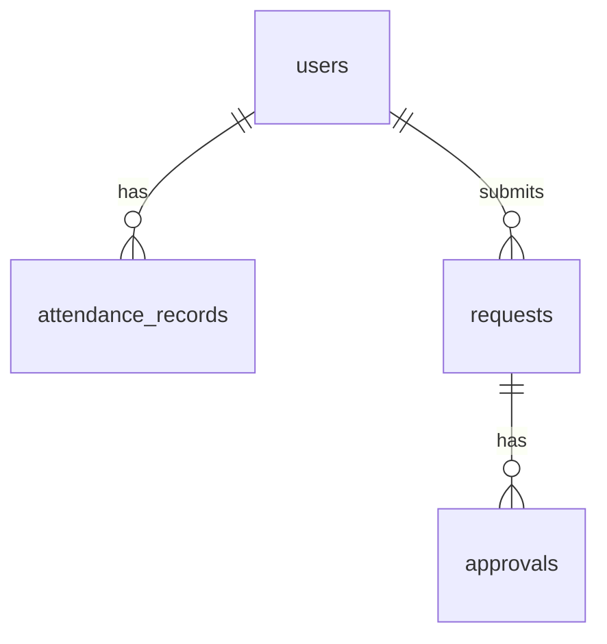

# 🏢 NatuG（ナツジー）Groupware App

企業向けの業務効率化を目的としたフルスタックグループウェアアプリケーション。
チャット・スケジュール管理・タスク管理・ファイル共有・ワークフロー・ナレッジ共有・勤怠管理・給与計算・社内検索などを一元化します。

---

## ✨ Features

* 🔐 認証（ログイン / 権限管理）
* 💬 チャット
* 📢 お知らせ
* 📚 Wiki
* 📅 スケジュール
* ✅ タスク管理
* 📁 ファイル共有
* 🔄 ワークフロー（申請・承認）
* ⏱ 勤怠管理
* 💰 給与計算
* 🔍 社内検索

---

## 🧱 Tech Stack

### Frontend

* React
* Vite
* React Router
* Zustand
* shadcn/ui

### Backend

* Laravel
* Laravel Sanctum

### Database

* PostgreSQL

### Infrastructure

* AWS (EC2)

---

## 📁 Project Structure

```
groupware-app/
├── frontend/   # React (Vite)
├── backend/    # Laravel API
├── docs/       # 設計資料
└── README.md
```

---

## 🚀 Getting Started

### 1. Clone

```bash
git clone https://github.com/your-repo/groupware-app.git
cd groupware-app
```

---

### 2. Backend Setup (Laravel)

```bash
cd backend

composer install

cp .env.example .env

php artisan key:generate
```

#### Database設定（.env）

```env
DB_CONNECTION=pgsql
DB_HOST=127.0.0.1
DB_PORT=5432
DB_DATABASE=groupware
DB_USERNAME=gw_user
DB_PASSWORD=password
```

```bash
php artisan migrate
php artisan serve --host=localhost --port=8000
```

ローカルでメール起動（Mailpit）

```bash
docker run -d --name mailpit -p 8025:8025 -p 1025:1025 axllent/mailpit
```

---

### 3. Frontend Setup (React)

```bash
cd frontend

npm install
npm run dev
```

---

## 🧪 テスト

ローカルで API とフロントの自動テストを実行できます。

GitHub に `push` したとき、または Pull Request を開いたときに **GitHub Actions**（`.github/workflows/ci.yml`）が動き、バックエンドの `php artisan test` とフロントの `pnpm test`・`pnpm run build` が自動実行されます。

### バックエンド（PHPUnit）

```bash
cd src/backend
php artisan test
```

特定のファイルだけ実行する例:

```bash
php artisan test tests/Feature/AuthFlowTest.php
```

### フロントエンド（Vitest）

```bash
cd src/frontend
pnpm install   # 初回のみ
pnpm test
```

ファイル変更のたびに再実行するウォッチモード:

```bash
pnpm test:watch
```

---

## 🌐 Production Deployment

* AWS EC2 (Ubuntu)
* Nginx
* Laravel (API)
* React (build配信)
* PostgreSQL

---

## 🧭 Routing

```
/login
/dashboard
/chat
/announcements
/wiki
/schedule
/tasks
/files
/workflow
/attendance
/payroll
/search
```

---

## 🧠 Architecture

```
React (SPA)
   ↓ API
Laravel
   ↓
PostgreSQL
```

---

## 🗺️ Development Roadmap

### Phase 1

* 認証
* ユーザー管理
* グループ管理

実装状況の詳細は `doc/300_Phase1_実装状況.md` を参照。

### Phase 2

* 勤怠管理
* ワークフロー

### Phase 3

* お知らせ
* ファイル共有

### Phase 4

* チャット
* タスク
* スケジュール

### Phase 5

* Wiki

### Phase 6

* 社内検索
* 給与計算

---

## 📊 ER Diagram



※詳細は `/docs` を参照

---

## 🎨 UI Design

* 日本語UI
* フォント：Kiwi Maru
* カードベースUI
* shadcn/ui風デザイン
* 癒し・落ち着きのある配色

---

## ⚠️ Notes

* MVPは「勤怠 + ワークフロー」
* フロントとバックは完全分離
* APIファースト設計

---

## 📌 License

GNU General Public License v3.0

---

## 🙌 Author

mshrynzw
